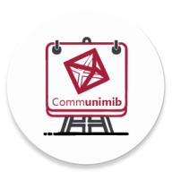

<!-- PROJECT LOGO -->
 

  

  <h3 align="center">03 - Communimib</h3>

  

    Progetto a cura di Luca Pinciroli, Marco Ferioli e Giulia Raffaella Vitale.
  

---

Communimib is an Android application that serves as a noticeboard and reporting system to improve communication within the Bicocca university.
The system was designed and developed by Luca Pinciroli, Marco Ferioli and Giulia Raffaella Vitale as part of a bachelor's thesis experiment to test the usefulness of LLMs in software development.
